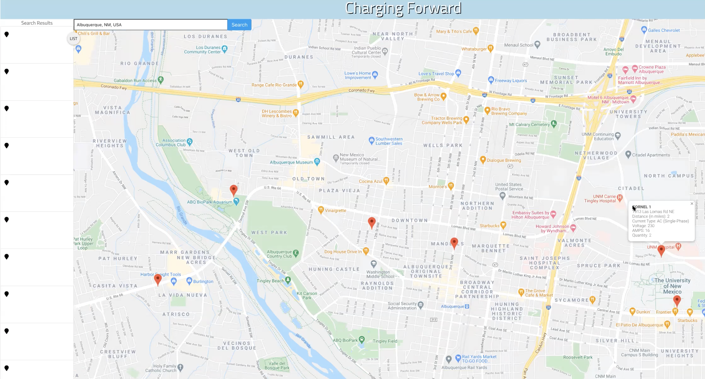

# Charging Forward

## Table of Contents

- [Description](#description)

- [Technologies Used](#technologies-used)

- [Deployed Link](#deployed-link)

- [Preview](#preview)

- [Questions](#questions)

## Description

Charging Forward is a Platform designed for every electric car owner in order to simplify their Life. To use this platform, all you need to type your city or state, click search and all the info you need is at your fingertips. Click the pin closest to your current location & get the info you need so you can keep Charging Forward.

## Technologies Used

**Languages:** Javascript, HTML5, CSS3

**Frameworks:** jQuery, Bulma

**Third Party APIs:** Google APIs, Open Charge Map API, MapQuest API

**Version Control:** Git and GitHub

**Hosting Platform:** Github Pages

## [Deployed Link](https://vlady14.github.io/Charging_Forward/)

## Preview

---

## 

---

## Questions

If you have any questions about the repo, open issue or contact us directly at [chargingforward@gmail.com](chargingforward@gmail.com).
